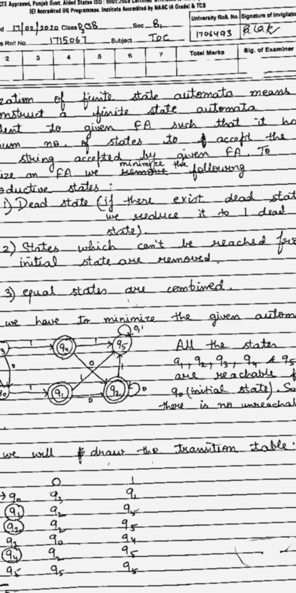

remove_red_color.py
===================

This is a script to remove variations of red color from image. And convert image
to black and white image.

[](https://github.com/psf/black)

Requirements
------------

1. python3.7
1. python3-opencv
1. python3-numpy
1. imagemagick

#### Installation of Requirements

```bash
sudo apt install python3.7 python3-opencv python3-numpy imagemagick
```

Usage
-----

This example show how you can remove red color from image.

```bash
bash main.sh input.jpeg
bash main.sh suraj_*.jpeg
bash main.sh input_dir/*
```

Output files will be written in present working directory with output file name
as InputFileName_output.png

#### Sample Input


#### Sample Output

